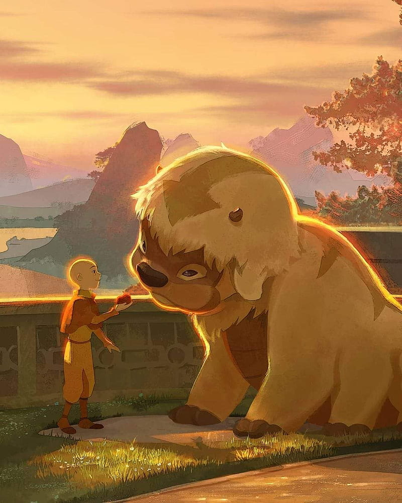

```{R echo=F, eval=F}
#to build this website into the _site directory, run
rmarkdown::site_generator()
```
 


<br>

# Hello! I am Appa!
  
</br>

##### I am a sky bison with six feet.

##### I enjoy flying and chewing on various grasses and apples. 

##### I consider Aang a lifelong comrade.  

##### I don't have any data-related projects either, but if I did you could find them [here](/portfolio)!

---
